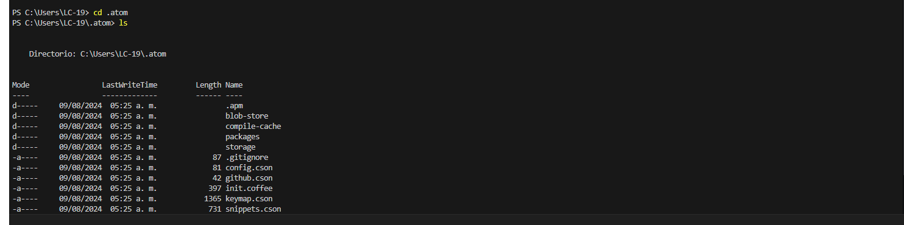
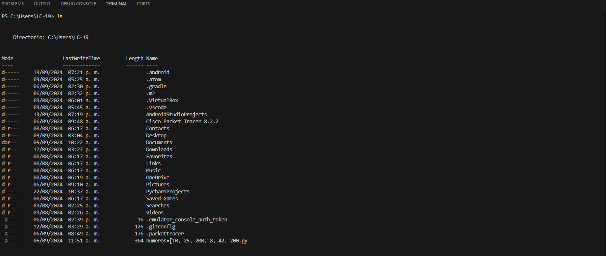
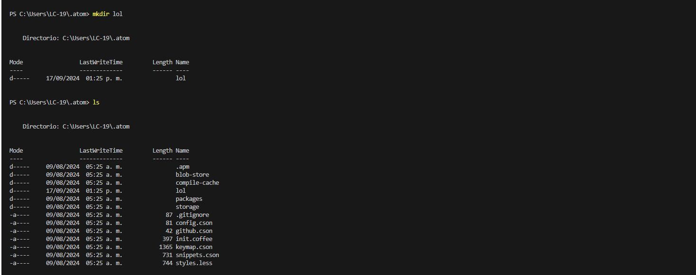
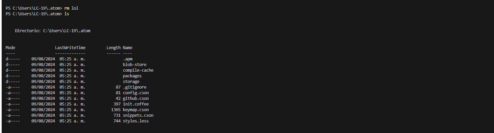
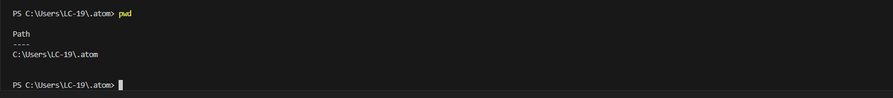

# Práctica de Comandos en Terminal

## Comando `cd`
El comando `cd` se utiliza para cambiar de directorio en la terminal. Nos permite navegar entre diferentes carpetas.

## Comando `ls`
El comando `ls` lista el contenido del directorio actual, mostrando archivos y carpetas dentro de él.

## Comando `mkdir`
El comando `mkdir` se usa para crear un nuevo directorio o carpeta.

## Comando `rm`
El comando `rm` se utiliza para eliminar archivos o directorios. Con la opción `-r`, puede eliminar directorios de manera recursiva, es decir, borrando su contenido también.

## Comando `pwd`
El comando `pwd` muestra la ruta del directorio de trabajo actual. Es útil para saber en qué carpeta nos encontramos.

